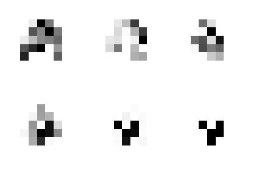

# convoca

Demonstrate and learn cellular automata using convolutional neural networks in TensorFlow

The video above shows different stages of training a network to learn Conway's Game of Life. 
This code can both implement and analyze known CA rulesets using TensorFlow, as well as learn the rules of unknown CA given image sequences as training data.

If you find this code useful, please consider citing the accompanying arXiv preprint:

> Gilpin, William. "Cellular automata as convolutional neural networks" 2018. [https://arxiv.org/abs/1809.02942](https://arxiv.org/abs/1809.02942)

For now, code is only in archival form for testing and analysis; future versions of this repository will significantly re-factor code into a general-purpose tool for cellular automaton analysis. All versions until a 1.0/PyPI release are thus tentative.

## Installation and Requirements

Typical installation time should be 5-10 minutes using Miniconda. This code should work on any operating system supported by Anaconda, but it has only been tested on macOS and Ubuntu.

+ Python >3.4
+ TensorFlow
+ numpy
+ matplotlib
+ Jupyter notebooks (for demos)

## Structure

The package contains the following libraries

`train_ca` : requires TensorFlow

`ca_funcs` : requires TensorFlow

`utils` : minor functions that support the main methods. Requires numpy only.

## Demos

The `demos` illustrates a minimal example of training a CNN on the Game of Life, including example outputs.

# To Do

+ Add methods for simulating totalistic CA
+ Add methods for Moore neighborhood CA
+ Add demos recreating classic experiments, such as the results in Langton. Physica D, 1990.
+ Add statistical physics calculations such as an efficient calculation of "activity" for a CA
+ CA on graphs using an adjacency matrix --> grid convolutional operator